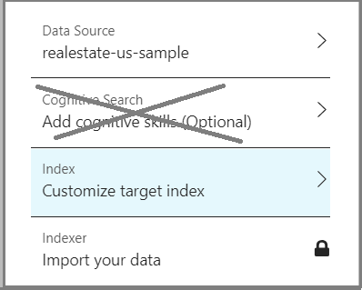
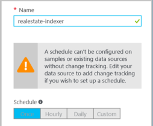
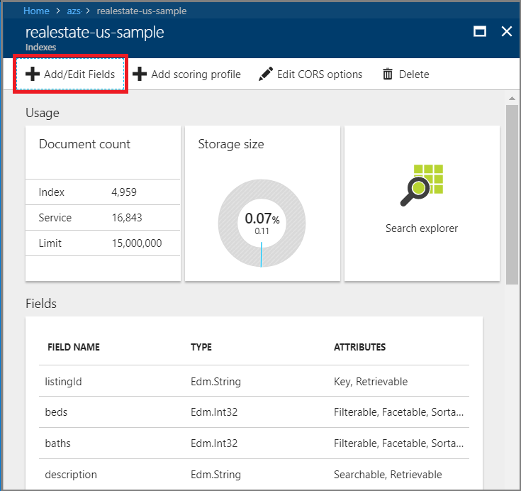

# 02. Create Indexer for Structured Data

## Tutorial: Use built-in tools for Azure Search indexing and queries

For a quick review and ramp up on Azure Search concepts, you can use the built-in tools provided in the Azure Search service page in the Azure portal. These tools may not offer the full functionality of the .NET and REST APIs. But the wizards and editors offer a code-free introduction to Azure Search, enabling you to write interesting queries against a sample data set right away.

> * Start with public sample data and auto-generate an Azure Search index using the **Import data** wizard.
> * View index schema and attributes for any index published to Azure Search.
> * Explore full text search, filters, facets, fuzzy search, and geosearch with **Search explorer**.  

## Prerequisites

[Create an Azure Search service](search-create-service-portal.md) or find an existing service under your current subscription.

1. Sign in to the [Azure portal](https://portal.azure.com).
2. Open the service dashboard of your Azure Search service. If you didn't pin the service tile to your dashboard, you can find your service this way:

   * In the Jumpbar, click **All services** on the left navigation pane.
   * In the search box, type *search* to get a list of search-related services for your subscription. Click **Search services**. Your service should appear in the list.

### Check for space

Many customers start with the free service. This version is limited to three indexes, three data sources, and three indexers. Make sure you have room for extra items before you begin. This tutorial creates one of each object.

> Tiles on the service dashboard show how many indexes, indexers, and data sources you already have. The Indexer tile shows success and failure indicators. Click the tile to view the indexer count.
>
> 
>

## <a name="create-index"></a> Create an index and load data

Search queries iterate over an [*index*](search-what-is-an-index.md) that contains searchable data, metadata, and additional constructs that optimize certain search behaviors.

For this tutorial, we use a built-in sample dataset that can be crawled using an [*indexer*](search-indexer-overview.md) via the **Import data** wizard. An indexer is a source-specific crawler that can read metadata and content from supported Azure data sources. These indexers are visible in the portal through the **Import data** wizard. Later on, you can programmatically create and manage indexers as independent resources.

### Step 1: Start the Import data wizard

1. From the Azure Search service dashboard, click **Import data** on the command bar to start the wizard. This wizard helps you create and populate a search index.

    

2. In the wizard, click **Connect to your data** > **Samples** > **realestate-us-sample**. This data source is preconfigured with a name, type, and connection information. Once created, it becomes an "existing data source" that can be reused in other import operations.

    

3. Click **OK** to use it.

### Skip Cognitive skills

**Import data** provides an optional cognitive skills step that enables you to add custom AI algorithms to indexing. Skip this step for now, and move on to **Customize target index**.

> You can try the new cognitive search preview feature for Azure Search from [cognitive search quickstart](cognitive-search-quickstart-blob.md) or [tutorial](cognitive-search-tutorial-blob.md).

   

### Step 2: Define the index

Typically, index creation is a manual exercise done using code. For this tutorial, the wizard can generate an index for any data source it can crawl. Minimally, an index requires a name and a fields collection; one of the fields should be marked as the document key to uniquely identify each document.

Fields have data types and attributes. The check boxes across the top are *index attributes* controlling how the field is used.

* **Retrievable** means that it shows up in search results list. You can mark individual fields as off limits for search results by clearing this checkbox, for example when fields used only in filter expressions.
* **Filterable**, **Sortable**, and **Facetable** determine whether a field can be used in a filter, a sort, or a facet navigation structure.
* **Searchable** means that a field is included in full text search. Strings are searchable. Numeric fields and Boolean fields are often marked as not searchable.

By default, the wizard scans the data source for unique identifiers as the basis for the key field. Strings are attributed as retrievable and searchable. Integers are attributed as retrievable, filterable, sortable, and facetable.

  

Click **OK** to create the index.

### Step 3: Define the indexer

Still in the **Import data** wizard, click **Indexer** > **Name**, and type a name for the indexer.

This object defines an executable process. You could put it on recurring schedule, but for now use the default option to run the indexer once, immediately, when you click **OK**.  

  

### Check progress

To monitor data import, go back to the service dashboard, scroll down, and double-click the **Indexers** tile to open the indexers list. You should see the newly created indexer in the list, with status indicating "in progress" or success, along with the number of documents indexed.

   

### Step 4: View the index

Tiles in the service dashboard provide both summary information of the various objects in a resources, as well as access to detailed information. The **Indexes** tile lists the existing indexes, including the *realestate-us-sample* index that you just created in the previous step.

Click the *realestate-us-sample* index now to view the portal options for its definition. An **Add/Edit Fields** option allows you to create and fully attribute new fields. Existing fields have a physical representation in Azure Search and are thus non-modifiable, not even in code. To fundamentally change an existing field, create a new one and the drop the original.

   

Other constructs, such as scoring profiles and CORS options, can be added at any time.

To clearly understand what you can and cannot edit during index design, take a minute to view index definition options. Grayed-out options are an indicator that a value cannot be modified or deleted. Similarly, skip the Analyzer and Suggester check boxes for now.

## <a name="query-index"></a> Query the index

Moving forward, you should now have a search index that's ready to query using the built-in [**Search explorer**](search-explorer.md) query page. It provides a search box so that you can test arbitrary query strings.

1. Click **Search explorer** on the command bar.

   

2. Click **Change index** on the command bar to switch to *realestate-us-sample*. Click **Set API version** on the command bar to see which REST APIs are available. For the queries below, use the generally available version (2017-11-11).

   ![Index and API commands][6]

3. In the search bar, enter the query strings below and click **Search**.

    > **Search explorer** is only equipped to handle [REST API request](https://docs.microsoft.com/rest/api/searchservice/search-documents). It accepts syntax for both [simple query syntax](https://docs.microsoft.com/rest/api/searchservice/simple-query-syntax-in-azure-search) and [full Lucene query parser](https://docs.microsoft.com/rest/api/searchservice/lucene-query-syntax-in-azure-search), plus all the search parameters available in [Search Document](https://docs.microsoft.com/rest/api/searchservice/search-documents) operations.
    >

### Simple query with top N results

#### Example (string): `search=seattle`

* The **search** parameter is used to input a keyword search for full text search, in this case, returning listings in King County, Washington state, containing *Seattle* in any searchable field in the document.

* **Search explorer** returns results in JSON, which is verbose and hard to read if documents have a dense structure. This is intentional; visibility of the entire document is important for development purposes, especially during testing. For a better user experience, you will need to write code that [handles search results](search-pagination-page-layout.md) to bring out important elements.

* Documents are composed of all fields marked as "retrievable" in the index. To view index attributes in the portal, click *realestate-us-sample* in the **Indexes** tile.

#### Example (parameterized): `search=seattle&$count=true&$top=100`

* The **&** symbol is used to append search parameters, which can be specified in any order.

* The **$count=true** parameter returns the total count all documents returned. This value appears near the top of the search results. You can verify filter queries by monitoring changes reported by **$count=true**. Smaller counts indicate your filter is working.

* The **$top=100** returns the highest ranked 100 documents out of the total. By default, Azure Search returns the first 50 best matches. You can increase or decrease the amount via **$top**.

### <a name="filter-query"></a> Filter the query

Filters are included in search requests when you append the **$filter** parameter. 

#### Example (filtered): `search=seattle&$filter=beds gt 3`

* The **$filter** parameter returns results matching the criteria you provided. In this case, bedrooms greater than 3.

* Filter syntax is an OData construction. For more information, see [Filter OData syntax](https://docs.microsoft.com/rest/api/searchservice/odata-expression-syntax-for-azure-search).

### <a name="facet-query"></a> Facet the query

Facet filters are included in search requests. You can use the facet parameter to return an aggregated count of documents that match a facet value you provide.

#### Example (faceted with scope reduction): `search=*&facet=city&$top=2`

* **search=*** is an empty search. Empty searches search over everything. One reason for submitting an empty query is to  filter or facet over the complete set of documents. For example, you want a faceting navigation structure to consist of all cities in the index.

* **facet** returns a navigation structure that you can pass to a UI control. It returns categories and a count. In this case, categories are based on the number of cities. There is no aggregation in Azure Search, but you can approximate aggregation via `facet`, which gives a count of documents in each category.

* **$top=2** brings back two documents, illustrating that you can use `top` to both reduce or increase results.

#### Example (facet on numeric values): `search=seattle&facet=beds`**

* This query is facet for beds, on a text search for *Seattle*. The term *beds* can be specified as a facet because the field is marked as retrievable, filterable, and facetable in the index, and the values it contains (numeric, 1 through 5), are suitable for categorizing listings into groups (listings with 3 bedrooms, 4 bedrooms).

* Only filterable fields can be faceted. Only retrievable fields can be returned in the results.

### <a name="highlight-query"></a> Highlight search results

Hit highlighting refers to formatting on text matching the keyword, given matches are found in a specific field. If your search term is deeply buried in a description, you can add hit highlighting to make it easier to spot.

#### Example (highlighter): `search=granite countertops&highlight=description`

* In this example, the formatted phrase *granite countertops* is easier to spot in the description field.

#### Example (linguistic analysis): `search=mice&highlight=description`

* Full text search finds word forms with similar semantics. In this case, search results contain highlighted text for "mouse", for homes that have mouse infestation, in response to a keyword search on "mice". Different forms of the same word can appear in results because of linguistic analysis.

* Azure Search supports 56 analyzers from both Lucene and Microsoft. The default used by Azure Search is the standard Lucene analyzer.

### <a name="fuzzy-search"></a> Try fuzzy search

By default, misspelled query terms, like *samamish* for the Samammish plateau in the Seattle area, fail to return matches in typical search. The following example returns no results.

#### Example (misspelled term, unhandled): `search=samamish`

To handle misspellings, you can use fuzzy search. Fuzzy search is enabled when you use the full Lucene query syntax, which occurs when you do two things: set **queryType=full** on the query, and append the **~** to the search string.

#### Example (misspelled term, handled): `search=samamish~&queryType=full`

This example now returns documents that include matches on "Sammamish".

When **queryType** is unspecified, the default simple query parser is used. The simple query parser is faster, but if you require fuzzy search, regular expressions, proximity search, or other advanced query types, you will need the full syntax.

Fuzzy search and wildcard search have implications on search output. Linguistic analysis is not performed on these query formats. Before using fuzzy and wildcard search, review [How full text search works in Azure Search](search-lucene-query-architecture.md#stage-2-lexical-analysis) and look for the section about exceptions to lexical analysis.

For more information about query scenarios enabled by the full query parser, see [Lucene query syntax in Azure Search](https://docs.microsoft.com/rest/api/searchservice/lucene-query-syntax-in-azure-search).

### <a name="geo-search"></a> Try geospatial search

Geospatial search is supported through the [edm.GeographyPoint data type](https://docs.microsoft.com/rest/api/searchservice/supported-data-types) on a field containing coordinates. Geosearch is a type of filter, specified in [Filter OData syntax](https://docs.microsoft.com/rest/api/searchservice/odata-expression-syntax-for-azure-search).

#### Example (geo-coordinate filters): `search=*&$count=true&$filter=geo.distance(location,geography'POINT(-122.121513 47.673988)') le 5`

The example query filters all results for positional data, where results are less than 5 kilometers from a given point (specified as latitude and longitude coordinates). By adding **$count**, you can see how many results are returned when you change either the distance or the coordinates.

Geospatial search is useful if your search application has a "find near me" feature or uses map navigation. It is not full text search, however. If you have user requirements for searching on a city or country by name, add fields containing city or country names, in addition to coordinates.

## Takeaways

This tutorial provided a quick introduction to using Azure Search from the Azure portal.

You learned how to create a search index using the **Import data** wizard. You learned about [indexers](search-indexer-overview.md), as well as the basic workflow for index design, including [supported modifications to a published index](https://docs.microsoft.com/rest/api/searchservice/update-index).

Using the **Search explorer** in the Azure portal, you learned some basic query syntax through hands-on examples that demonstrated key capabilities such as filters, hit highlighting, fuzzy search, and geo-search.

You also learned how to use the tiles in the portal dashboard for the search index, indexer, and  data sources. Given any new data source in the future, you can use the portal to quickly check its definitions or field collections with minimal effort.


```
facet=Copyright&facet=Style&$filter=Style eq 'Unisex'
```

---
Ref: https://docs.microsoft.com/en-us/azure/search/search-get-started-portal

[03. Create Indexer for Unstructured Data](03CreateIndexerBlob.md)