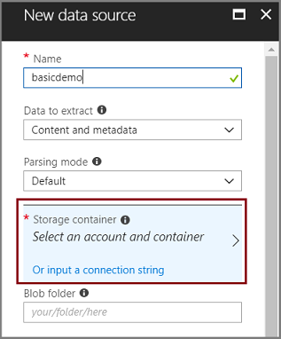
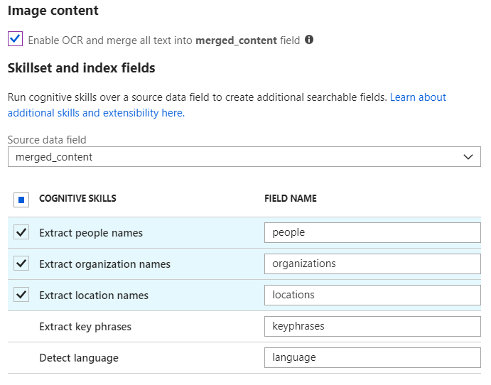
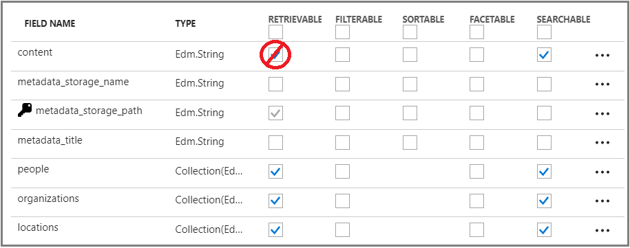
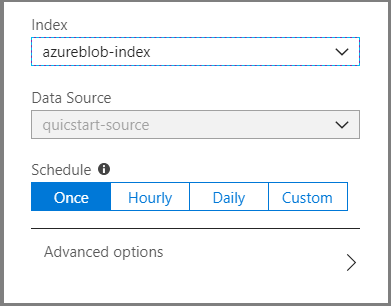
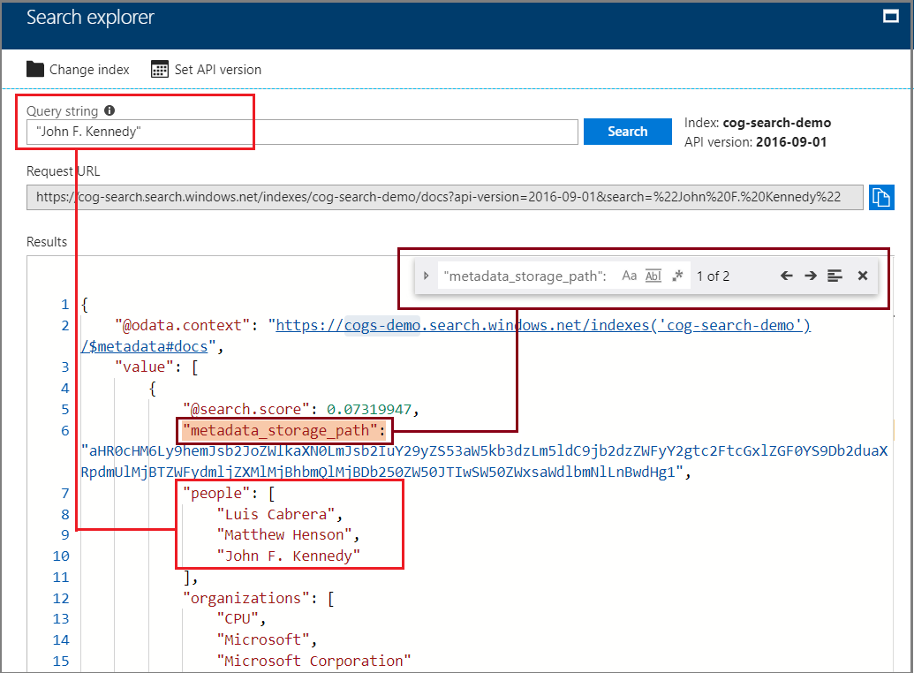

# 03. Create Indexer for Unstructured Data

## Cognitive search ##
Cognitive search adds data extraction, natural language processing (NLP), and image processing to an Azure Search indexing pipeline, making unsearchable or unstructured content more searchable. Information created by a skill, such as entity recognition or image analysis, gets added to an index in Azure Search.

Let’s try the enrichment pipeline in the Azure portal before writing a single line of code:
* Begin with sample data in Azure Blob storage
* Configure the Import Wizard for indexing and enrichment
* Run the wizard (an entity skill detects people, location, and organizations)
* Use Search Explorer to query the enriched data.

## Prerequisites ##
Azure services are used exclusively in this scenario. Creating the services you need is part of the preparation.
* Azure Blob storage provides the source data.
* Azure Search handles data ingestion and indexing, cognitive search enrichment, and full text search queries.

## Set up Azure Search ##
First, sign up for the Azure Search service.
1.	Go to the Azure portal and sign in by using your Azure account.
2.	Click Create a resource, search for Azure Search, and click Create. See Create an Azure Search service in the portal if you are setting up a search service for the first time and you need more help. 

3.	For Resource group, create a resource group to contain all the resources you create in this tutorial. 
4.	For Location, choose either South Central US or West Europe. Currently, the preview is available only in these regions.
5.	For Pricing tier, you can create a Free service to complete this lab. For deeper investigation using your own data, create a paid service such as Basic or Standard.
A Free service is limited to 3 indexes, 16 MB maximum blob size, and 2 minutes of indexing, which is insufficient for exercising the full capabilities of cognitive search. To review limits for different tiers, see Service Limits.
6.	Pin the service to the dashboard for fast access to service information.

## Set up Azure Blob service and load sample data ##
The enrichment pipeline pulls from Azure data sources supported by Azure Search indexers. For this exercise, we use blob storage to showcase multiple content types.
1.	Download sample data consisting of a small file set of different types.
2.	Sign up for Azure Blob storage, create a storage account, sign in to Storage Explorer, and create a container. See Azure Storage Explorer Quickstart for instructions on all the steps.
3.	Using the Azure Storage Explorer, in the container you created, click Upload to upload the sample files.

## Create the enrichment pipeline ##
Go back to the Azure Search service dashboard page and click Import data on the command bar to set up enrichment in four steps.

## Step 1: Create a data source ##

In Connect to your data > Azure Blob storage, select the account and container you created. Give the data source a name, and use default values for the rest.

Click OK to create the data source.

One advantage of using the Import data wizard is that it can also create your index. As the data source is created, the wizard simultaneously constructs an index schema. It can take a few seconds to create the index.

One advantage of using the Import data wizard is that it can also create your index. As the data source is created, the wizard simultaneously constructs an index schema. It can take a few seconds to create the index.

## Step 2: Add cognitive skills ##
Next, add enrichment steps to the indexing pipeline. The portal gives you predefined cognitive skills for image analysis and text analysis. In the portal, a skillset operates over a single source field. That might seem like a small target, but for Azure blobs the content field contains most of the blob document (for example, a Word doc or PowerPoint deck). This field is an ideal input because all of a blob's content is there.

Sometimes you would like to extract the textual representation from files that are composed of mostly scanned images, like a PDF that gets generated by a scanner. Azure Search can automatically extract content from embedded images in the document. To do that, select the Enable OCR and merge all text into merged_content field option. This will automatically create a merged_contentfield that contains both the text extracted from the document as well as the textual representation of images embedded in the document. When you select this option the Source data field will be set to merged_content.

In Add cognitive skills, choose skills that perform natural language processing. For this quickstart, choose entity recognition for people, organizations, and locations.

Click OK to accept the definition.

Natural language processing skills operate over text content in the sample data set. Since we didn't select any image processing options, the JPEG files found in the sample data set won't be processed in this quickstart.

## Step 3: Configure the index ##
Remember the index that was created with the data source? In this step, you can view its schema and potentially revise any settings.
For this quickstart, the wizard does a good job setting reasonable defaults:
* Every index must have a name. For this data source type, the default name is azureblob-index.
* Every document must have a key. The wizard chooses a field having unique values. In this quickstart, the key is metadata_storage_path.
* Every field collection must have fields with a data type describing its values, and each field should have index attributes that describe how its used in a search scenario.
Because you defined a skillset, the wizard assumes that you want the source data field, plus the output fields created by the skills. For this reason, the portal adds index fields for content, people, organizations, and locations. Notice that the wizard automatically enables Retrievable and Searchable for these fields.
In Customize index, review the attributes on the fields to see how they are used in an index. Searchable indicates a field can be searched. Retrievable means it can be returned in results.
Consider clearing Retrievable from the content field. In blobs, this field can run into thousands of lines, difficult to read in a tool like Search explorer.
Click OK to accept the index definition.

## Step 4: Configure the indexer ##
The indexer is a high-level resource that drives the indexing process. It specifies the data source name, the index, and frequency of execution. The end result of the Import data wizard is always an indexer that you can run repeatedly.
In the Indexer page, give the indexer a name and use the default "run once" to run it immediately.
Click OK to import, enrich, and index the data.

Indexing and enrichment can take time, which is why smaller data sets are recommended for early exploration. You can monitor indexing in the Notifications page of the Azure portal.

## Query in Search explorer ##
After an index is created, you can submit queries to return documents from the index. In the portal, use Search explorer to run queries and view results.
1.	On the search service dashboard page, click Search explorer on the command bar.
2.	Select Change Index at the top to select the index you created.
3.	Enter a search string to query the index, such as "John F. Kennedy".
Results are returned in JSON, which can be verbose and hard to read, especially in large documents originating from Azure blobs.
If you can't scan results easily, use CTRL-F to search within documents. For this query, you could search within the JSON on "John F. Kennedy" to view instances of that search term.

CTRL-F can also help you determine how many documents are in a given result set. For Azure blobs, the portal chooses "metadata_storage_path" as the key because each value is unique to the document. Using CTRL-F, search for "metadata_storage_path" to get a count of documents. For this query, two documents in the result set contain the term "John F. Kennedy".

---
[04. Integrate Search into your Web App](https://github.com/jakazmie/AIDays/blob/master/KnowledgeMining/04IntegrateintoApp.md)
